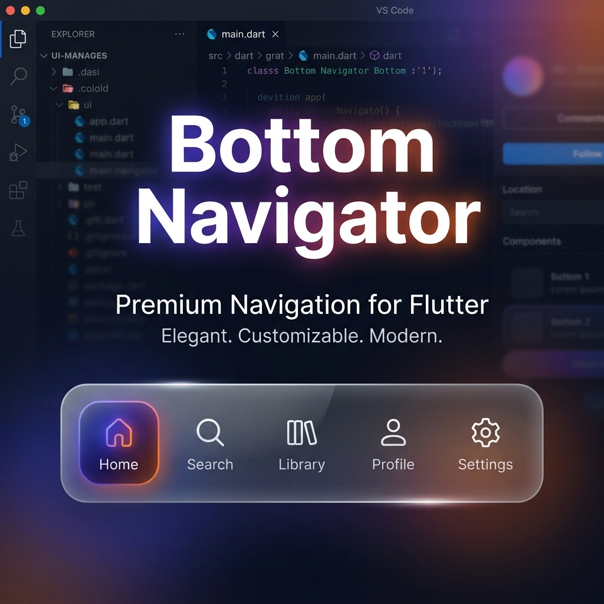

# Bottom Navigator

[](https://pub.dev/packages/bottom_navigator)
[](https://opensource.org/licenses/MIT)

Current stable release: `0.0.2`

A premium, glassmorphic bottom navigation bar for Flutter. Elevate your app's UI with fluid animations, multiple layout variants, and automatic overflow management.



## ✨ Features

- 🧊 **Glassmorphism**: Built-in frosted glass effect with customizable blur and opacity.
- 📐 **Multiple Variants**: Choose between **Floating**, **Docked**, **Notched**, and **Classic** layouts.
- ⚡ **Auto-More**: Automatically handles item overflow by grouping extra items into a premium "More" menu.
- 🎨 **Indicator Styles**: Support for various selection indicators: Pill, Line, Square, Circle, and None.
- 📜 **Scroll Aware**: Built-in support for hiding the navigation bar on scroll to maximize screen real estate.
- 🎬 **Fluid Animations**: Smooth transitions and physics-based animations for a premium feel.
- 🛠️ **Highly Customizable**: Fine-tune colors, icons, labels, animation curves, and more.

## 🚀 Getting Started

Add the dependency to your `pubspec.yaml`:

```yaml
dependencies:
  bottom_navigator: ^0.0.2
```

## 🛠️ Usage

### Classic Bottom Bar

```dart
ClassicNavBottomBar(
  items: [
    BottomNavItem(icon: Icons.home, label: 'Home'),
    BottomNavItem(icon: Icons.search, label: 'Search'),
    BottomNavItem(icon: Icons.favorite, label: 'Likes'),
    BottomNavItem(icon: Icons.person, label: 'Profile'),
  ],
  currentIndex: _selectedIndex,
  onTap: (index) => setState(() => _selectedIndex = index),
)
```

### Floating Glass Bar

```dart
FloatingNavBottomBar(
  items: navItems,
  currentIndex: _selectedIndex,
  centerButton: FloatingActionButton(
    onPressed: () {},
    child: Icon(Icons.add),
  ),
  onTap: (index) => setState(() => _selectedIndex = index),
)
```

### Docked Bar

```dart
DockedNavBottomBar(
  items: navItems,
  currentIndex: _selectedIndex,
  onTap: (index) => setState(() => _selectedIndex = index),
)
```

### Notched Bar

```dart
NotchedNavBottomBar(
  items: navItems,
  currentIndex: _selectedIndex,
  onTap: (index) => setState(() => _selectedIndex = index),
)
```

## 🎨 Customization

You can customize the selection indicator using the `IndicatorStyle` classes:

- `PillIndicatorStyle()`
- `LineIndicatorStyle()`
- `SquareIndicatorStyle()`
- `CircleIndicatorStyle()`
- `IndicatorStyle.none`

You can also customize the "More" overflow button using `moreButtonLabel`, `moreButtonWidget`, and `showSelectedMoreItem`.

### Handling Scroll

To hide the bar when scrolling, simply provide your `ScrollController`:

```dart
ClassicNavBottomBar(
  // ... other properties
  hideOnScroll: true,
  scrollController: _myScrollController,
)
```

## 📝 Additional Information

### Contributing
Contributions are welcome! Please feel free to submit a Pull Request.

### Issues
If you encounter any bugs or have feature requests, please file them on the [issue tracker](https://github.com/handelika/bottom_navigator/issues).

### License
This project is licensed under the MIT License - see the [LICENSE](LICENSE) file for details.
